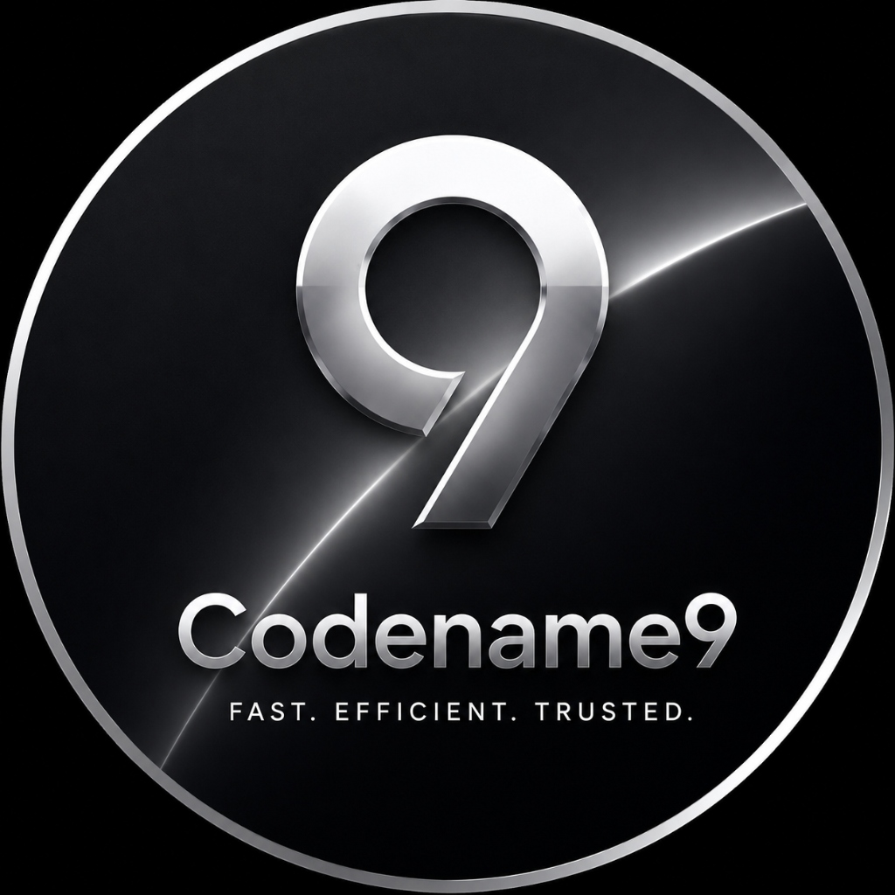

# nyase - Tresillo

**개념에서 프로덕션까지 제품을 완성하는 풀스택 시스템 빌더, 김건우(nyase)입니다.**

아이디어 설계부터 프론트엔드, 백엔드, 고성능 분산 아키텍처 및 인프라 운영까지 제품의 전 영역을 직접 구축합니다.

**Languages**

**Frontend**

**Backend · Data**

**Infra**

---

### 🚀 대표 프로젝트

| 프로젝트 | 한 줄 소개 | 핵심 기술 |
|---|---|---|
| **[ryllis](https://github.com/NiSeullent/ryllis)** | Anemone 프레임워크 기반 위키·블로그 엔진. Go 마이크로서비스 3종(Engine/Renderer/Gateway)을 **자작 UDP 프로토콜(RSock)** 로 연결 | `Go` · `React 19 SSR` · `PostgreSQL` · `JWT/RBAC` · `나무마크 파서` |
| **[open-zuzunza](https://github.com/NiSeullent/open-zuzunza)** | 실시간 기능을 갖춘 풀스택 콘텐츠 플랫폼. WebSocket 서버 + 피드·랭킹·캐시 설계 | `Next.js` · `WebSocket` · `Supabase` · `TypeScript` |
| **[moabuilder](https://github.com/NiSeullent/moabuilder)** | 위젯 기반 CMS를 **프레임워크부터 자작**. 이중 인증·RBAC·CSRF·IP 제한·SQLi 방어·커넥션 풀 내장 | `PHP` · `Tailwind v4` · `Custom CMS` |
| **[zuzunza_mobile](https://github.com/NiSeullent/zuzunza_mobile)** | Zuzunza 모바일 클라이언트 | `Flutter` · `Dart` |
| **[opseat](https://github.com/NiSeullent/opseat)** | **시뮬레이티드 어닐링** 최적화 기반 자리 배치 웹 | `JavaScript` · `Optimization` |

---

### 💡 주요 핵심 강점

- **분산 시스템 설계** — 마이크로서비스 분리, 자작 UDP 통신 프로토콜(RSock) 설계 및 최적화
- **프레임워크 코어 자작** — CMS·위키 엔진을 라이브러리 의존 없이 코어 단계부터 설계 및 구현
- **실시간 데이터 처리** — WebSocket 기반의 고효율 라이브 피드, 푸시 알림 및 동적인 실시간 랭킹 시스템 구축
- **보안 중심 아키텍처** — RBAC · JWT · CSRF 방어 · IP 제한 · SQL Injection 원천 차단을 아키텍처 수준에서 내재화
- **자체 알고리즘 및 파서** — 나무마크 마크업 파싱 엔진 및 시뮬레이티드 어닐링(Simulated Annealing) 최적화 알고리즘 설계
- **종합 풀스택 스택** — Frontend (React/Svelte), Mobile (Flutter), Backend (Go/PHP/Node.js), Infra (Docker/Vercel) 통합 관리

---

#### "Codename9는 작은 팀이지만 강력합니다."
#### "긴밀한 소통과 책임감 있는 개발로 최고의 결과물을 제공합니다."

---

