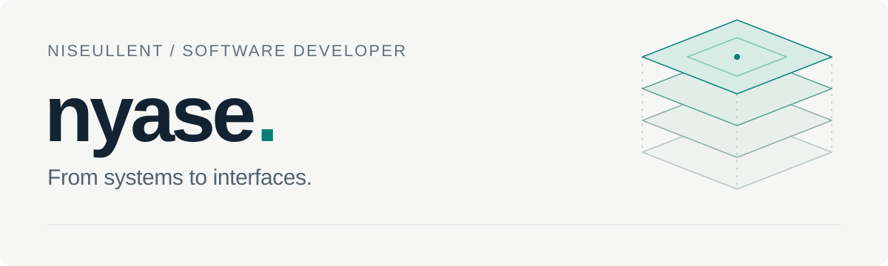

<picture>
  <source media="(prefers-color-scheme: dark)" srcset="./assets/profile-dark.svg">
  <source media="(prefers-color-scheme: light)" srcset="./assets/profile-light.svg">
  
</picture>

 

### Hi, I'm Shizuku.

A junior developer in Seoul, building under **nyase**. I explore graphics runtimes, backend services, and design systems. I like understanding how the layers fit together — then making something useful with them.

[Website](https://zuzunza.com) &nbsp; / &nbsp; [Email](mailto:sharhene777@gmail.com) &nbsp; / &nbsp; [All repositories](https://github.com/NiSeullent?tab=repositories)

 

## Selected work

<table>
  <tr>
    <td width="50%" valign="top">
      01 / GRAPHICS &amp; SYSTEMS
      <h3><a href="https://github.com/NiSeullent/Mellow">Mellow ↗</a></h3>
      
An experimental graphics runtime and GPU driver-porting toolkit, exploring OpenGL/OpenCL workloads and Metal.

      
<code>C</code> <code>C++</code> <code>Graphics</code>

      Experimental · Compatibility work in progress
    </td>
    <td width="50%" valign="top">
      02 / INTERFACES &amp; DESIGN
      <h3><a href="https://github.com/NiSeullent/neonux-core">NeonUX Core ↗</a></h3>
      
A design-system core with semantic tokens, light and dark themes, React shells, and reusable UI primitives.

      
<code>TypeScript</code> <code>React</code> <code>CSS</code>

      Design system · Tokens to components
    </td>
  </tr>
  <tr>
    <td width="50%" valign="top">
      03 / SERVICES &amp; ARCHITECTURE
      <h3><a href="https://github.com/NiSeullent/ryllis2">ryllis2 ↗</a></h3>
      
A small social-service experiment in Go, built to study layered routing, middleware, and service boundaries.

      
<code>Go</code> <code>React</code> <code>TypeScript</code>

      Educational · A service architecture workbench
    </td>
    <td width="50%" valign="top">
      04 / AUDIO &amp; CREATIVE TOOLS
      <h3><a href="https://github.com/NiSeullent/utau-diff-voicebank">UTAU Diff Voicebank ↗</a></h3>
      
A Python pipeline for turning personal recordings into Japanese UTAU voicebanks using Seed-VC voice conversion.

      
<code>Python</code> <code>Seed-VC</code> <code>Audio</code>

      Creative tooling · Recordings to voicebanks
    </td>
  </tr>
</table>

Also exploring **[Plopi](https://github.com/NiSeullent/plopi)** — hosting comparison and deployment tooling.

 

## How I work

- **Follow the boundary.** Trace a problem from the interface to the service, runtime, or hardware underneath.
- **Make the work readable.** Document the intent, setup, trade-offs, and known limits.
- **Keep learning in public.** Build small experiments, label what's unfinished, and leave a useful trail.

 

---

**nyase** / Building broad. Learning in detail.
